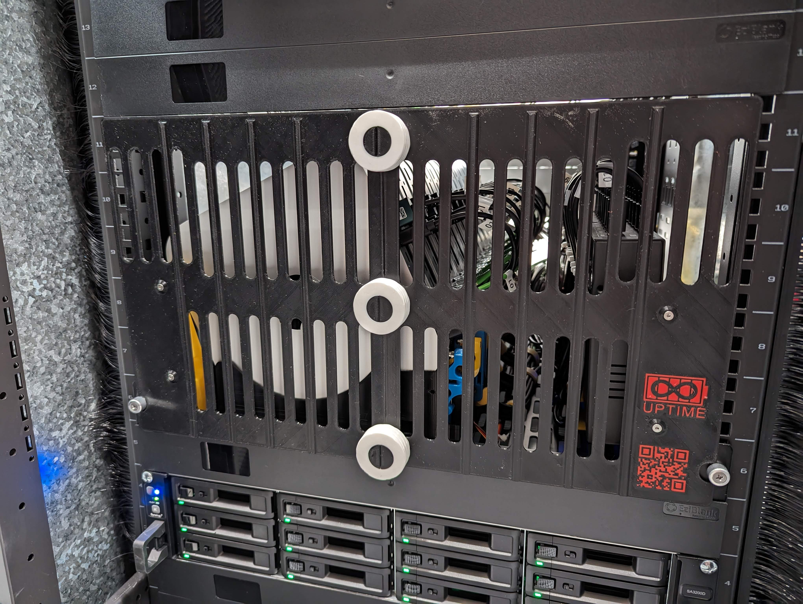

 

  <h3 align="center">KVM rack stand for Mac minis, KVMac16</h3>

  

    Sometimes you just wish you had more control
     
     
  

     

## Official Discord server

Join the [link](https://discord.gg/2MZjPUU59P) to our cozy [Discord server](https://discord.gg/2MZjPUU59P), where you can ask any questions about the project and not only. And look forward to seeing you on [Twitter (X)](https://twitter.com/Merocle) and [Instagram](https://www.instagram.com/uptime.lab/)

## About The Project

**The main task is to give full control over a group of Mac mini installed in a remote data center.**\

You can read more about the project on the official website at the [link (KVM rack stand for Mac minis, KVMac16)](https://uplab.pro/2023/11/kvm-rack-stand-for-mac-minis-kvmac16/)

And about how to assemble such a stand read in the second part of the article at the [link  (KVM rack stand for Mac minis, KVMac16, part 2)](https://uplab.pro/2023/12/kvm-rack-stand-for-mac-minis-kvmac16-part-2/)

## Images

The latest iteration in the server rack

Front panel

The heart of remote management

## Author

*Ivan Kuleshov*
* [GitHub](https://github.com/Merocle)
* [Twitter (X)](https://twitter.com/Merocle)
* [Instagram](https://www.instagram.com/uptime.lab/)